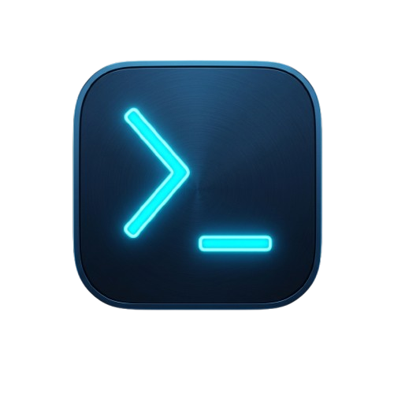

<div align="center">



# DashowBoard

Seu cockpit desktop para acompanhar projetos, deploys, serviços e incidentes em um só lugar.


[Conheça o projeto](https://enzocaetano015.github.io/DashowBoard/)

</div>

## Sobre

O DashowBoard é um aplicativo desktop open-source que centraliza informações de projetos distribuídos entre GitHub, Vercel, Railway e Supabase.

Ele organiza vínculos locais, monitora serviços e deployments, registra incidentes e mantém configurações e histórico em um banco SQLite local. O aplicativo não exclui nem administra recursos externos.

## Principais recursos

- visão geral de projetos e serviços;
- integrações com GitHub, Vercel, Railway e Supabase;
- monitoramento de disponibilidade e health checks;
- histórico de status e incidentes;
- persistência local com SQLite;
- aplicativo desktop com Tauri 2.

## Stack

React 19, TypeScript, Vite, Tauri 2, Rust, TanStack Query, React Router, Tailwind CSS, shadcn/ui e SQLite.

## Início rápido

```bash
git clone https://github.com/EnzoCaetano015/DashowBoard.git
cd DashowBoard
pnpm install
pnpm tauri dev
```

Para executar apenas a interface no navegador:

```bash
pnpm dev
```

Recursos nativos, integrações e o banco local exigem o runtime do Tauri.

## Documentação

| Guia | Conteúdo |
|---|---|
| [Arquitetura](./docs/arquitetura.md) | Fluxo da aplicação, camadas e estrutura do código. |
| [Domínio e monitoramento](./docs/dominio-e-monitoramento.md) | Projetos, repositórios, serviços, status e incidentes. |
| [Desenvolvimento](./docs/desenvolvimento.md) | Ambiente local, comandos, testes e banco de dados. |
| [Integrações e segurança](./docs/integracoes-e-seguranca.md) | Providers, tokens, permissões e tratamento de erros. |
| [Publicação e contribuição](./docs/publicacao-e-contribuicao.md) | Landing page, CI, releases e fluxo de contribuição. |

## Autor

Desenvolvido por **Enzo Caetano**.

- [GitHub](https://github.com/EnzoCaetano015)
- [Portfólio](https://www.caetanodev.com/)
- [LinkedIn](https://www.linkedin.com/in/enzo-caetano-814736290/)
