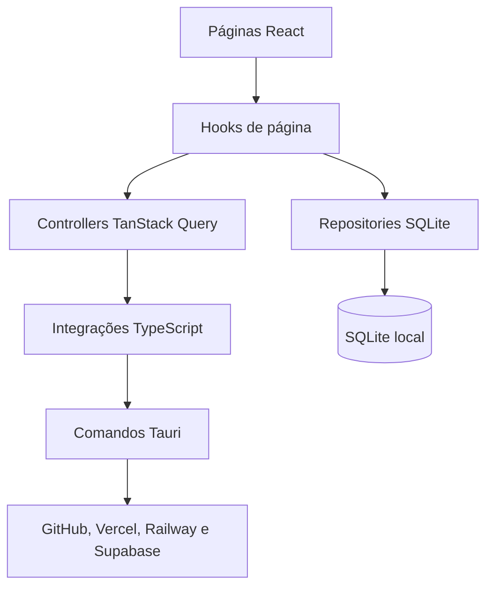

# Arquitetura

[← Voltar ao README](../README.md)

O DashowBoard combina uma interface React com recursos nativos fornecidos pelo Tauri. A aplicação usa o SQLite para persistência local e comandos Rust para operações que exigem acesso seguro ao sistema ou às APIs externas.

## Fluxo principal

## Camadas

### `src/pages`

Monta as telas, consome hooks de página e trata os estados de carregamento, erro, vazio e sucesso. Componentes e modais exclusivos ficam junto da página que os utiliza.

### `src/components`

Contém componentes reutilizáveis. Primitivas visuais do shadcn/ui ficam em `src/components/ui`; componentes de domínio ficam em pastas próprias.

### `src/backend/api`

- `controllers`: hooks e mutations do TanStack Query;
- `integrations`: fronteira entre o frontend e os comandos Tauri;
- `models`: contratos externos e modelos normalizados;
- `enums`: providers, status e demais valores conhecidos.

### `src/backend/sql`

Centraliza a conexão SQLite, migrations, transações e repositories. Páginas e componentes não executam SQL diretamente.

### `src/lib`

Reúne configurações compartilhadas, hooks globais, tipos utilitários e funções puras.

### `src-tauri`

Contém o runtime nativo, os clientes dos providers, o armazenamento seguro de credenciais, o health check, a bandeja do sistema e os comandos expostos ao frontend.

## Navegação e estado

As rotas usam `createHashRouter`, o que mantém a navegação compatível com o aplicativo empacotado. Dados remotos são controlados pelo TanStack Query; o SQLite é usado para configuração, vínculos, histórico e incidentes, não como cache temporário das consultas.

## Princípios

- chamadas externas, SQL e APIs do Tauri não ficam em componentes visuais;
- cada provider falha de forma independente, sem bloquear os demais;
- operações remotas destrutivas não fazem parte do escopo atual;
- mudanças de estado relevantes são persistidas como incidentes;
- permissões nativas e de rede devem permanecer mínimas.

